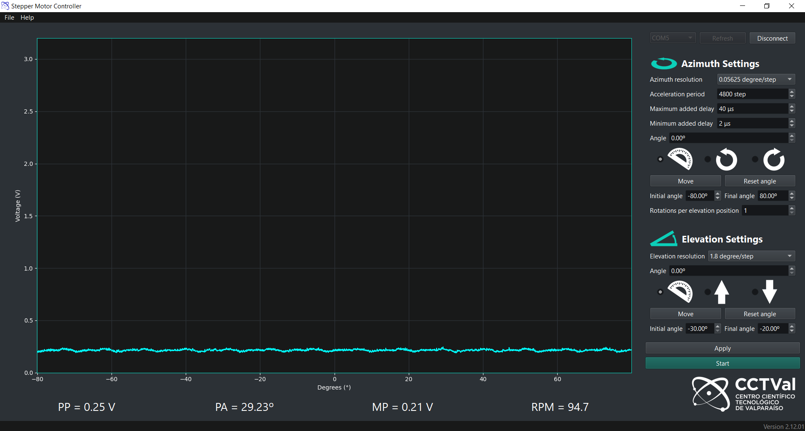

# Stepper Motor Controller
A simple Graphical User interface made to communicate with a microcontroller via a serial port to control the azimuth and elevation positions of an antenna and plot the power measured at each position.

An image of the current state of the GUI is given below


## Installation
#### Install requirements
```
pip install -r requirements.txt
```
#### Create executable file with pyinstaller

```
pyinstaller --onefile --noconsole --icon logo.ico mainWindow.py
```
#### Running program without executable
Open a command prompt inside GUI folder, and write
```
python mainWindow.py
```
The GUI has been tested with Python 3.9 and Python 3.8
